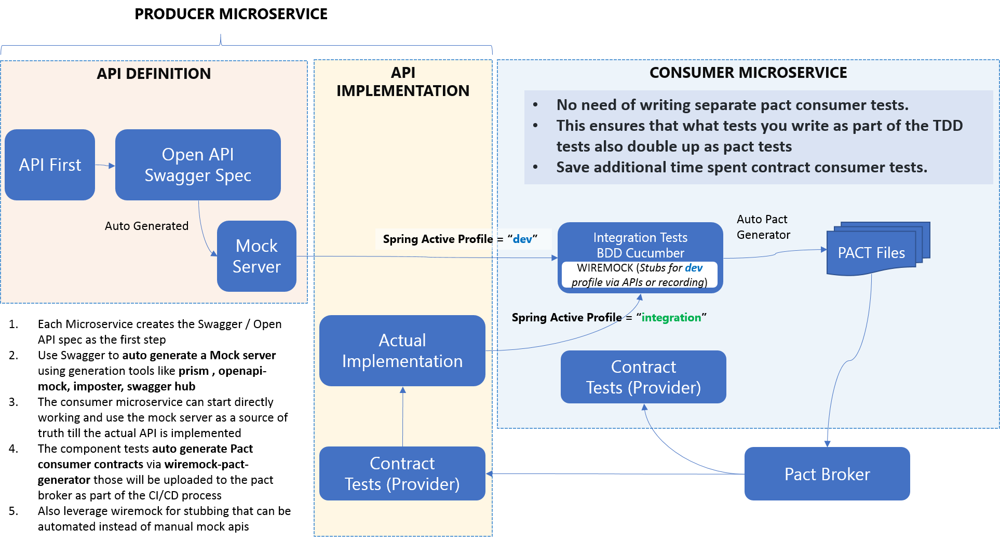
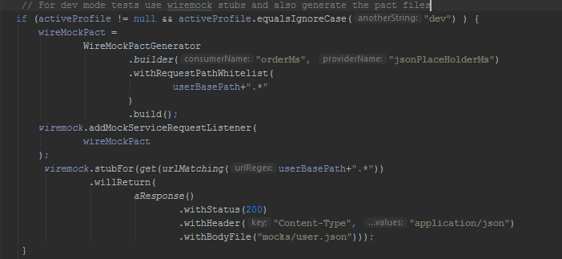
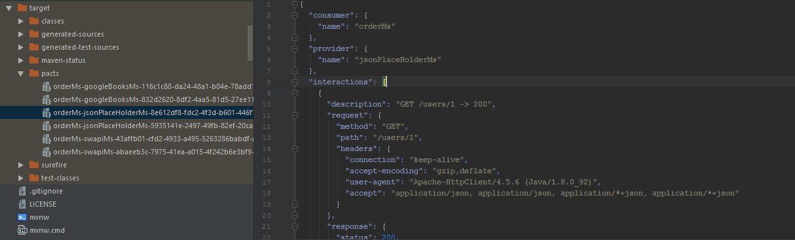

# springboot-cucumber-demo

BDD - Java - Maven based integration testing using Cucumber and Rest Assured

## Objective

* Create a reference implementation which provides the best practices of running integration & component tests in a SpringBoot application
* While Rest Assured provides an excellent DSL to quickly create component and integration tests , using Cucumber will provide us a not only creating readable and maintainable code , but also being able communicate the requirements across various stakeholdes in a human readable language.
* Gherkin (used by Cucumber to define the automated tests) along with Rest Assured provides a very effective solution for the same.
* For Component level tests - we can mock the external apis 
* For Integration level tests - a different provide can be used to use actual APIs rather than mocks

### Technologies

* Spring Boot Test - Provides the spring boot ecosystem required for the tests
* Rest Assured - Provides the service client APIs using the powerful DSL for creating maintainable tests
* Rest Assured JSON Schema Validator - Response Schema Validation
* Hamcrest - Assertions
* Swagger Request Validator for Rest Assured (`swagger-request-validator-restassured`) - Use Rest Assured to validate the API response using the swagger spec (TBD)
* Cucumber (with Spring Boot) - BDD based Integration Test and Component Tests
* Spring Cloud Contract WireMock
    * The WireMock server is setup using the `@AutoConfigureWireMock(port = 8091)` annotation
    * Also mock responses are setup either programmatically wiremock APIs using the json files or placing the wiremock stubs in the [test/resource/mappings](src/test/resources/mappings) folder
    * As an example the google books api has been wiremock stub has been recorded using the [wiremock standalone server](http://wiremock.org/docs/record-playback/) 
    * The programmaticaly created wiremock stubs are demonstrated in the files [OrderSteps](src/test/java/com/tsukhu/demo/steps/OrderSteps.java) and [SwapiSteps](src/test/java/com/tsukhu/demo/steps/SwapiSteps.java) 
* Spring Profiles to use the same test using the mock server or hitting the actual endpoints
    * `Dev Mode` - All external endpoints are provided using the WireMock server that serves the responses via stubs and mock json output
    * `Integration Mode` - Actual endpoints are hit
* Automatic Pact file generation for each of the test scenarios , based on the registered Pact listeners using `wiremock-pact-generator`
    * This can be extended to push the generated pact files to the Pact broker
    * This is enabled in the `dev` profile and at the end of the execution the `target\pacts` folder contains the generated pact files
    * Advantage
        * No need of writing separate pact consumer tests.
        * This ensures that what tests you write as BDD cucumber tests also double up as pact tests

#### Approach


### Application Structure

* Resource Endpoint `/order/{skucode}/` - This is a demo api where the `skucode` is provided as url path variable. 
 * This will return order details that has the user details populated from the `jsonplaceholder.typicode.com/users` developer API

#### Tests

* The BDD tests are setup using `CucumberIntegrationTest` class that provides the cucumber configuration and depends on
    * The `SpringIntegrationTest` class : this wires up the spring boot tests and starts the server and the wiremock server at port `8091`
    * The `steps` folder provides the glue code or test steps (bound to the features)
    * The `resource\features` folder provides the BDD test scenarios
* Tests added so far:
    * `Google Books API Scenario` (**external API test**)- Check books details based on a specific search
    * `Order API Scenario` (**internal and external API test**) - This is a controller resource API BDD test as well as an external API (called internally by the resource).
    * `Swapi API Scenario` (**external**)The Starwars API based test.
    * `Java Streams Scenario` (**internal**) Java Stream APIs related tests
    * [Test Scenarios Folder](./src/test/resources/features)
    * Gherkin test scenario step types (added)
        * Basic parameterized GET
        * Scenario Outline - Data Driven Test template
        * Response Schema Validation
        * JSON Response validation using a simple table
        * POJO Class initialization via tests
    
* Testing locally / Dev mode:
    * In a microservices environment we generally do not have access to some of the external dependencies during the development time.
    * This example uses the `Spring Boot Profiles` and `WireMock` to be able to test in both the dev mode (with no access to external APIs) and integration mode (with direct access to the external APIs)
        * When spring active profile is set to `dev` : 
            * Wiremock is used to stub out the external APIs (including the ones used internally by the controller)
            * The Wiremock pact generator is configured as a resource listener on specific external API (producer) urls
            * Each cucumber step file mocks the respective external APIs
            
            * Post execution the pact files are automatically generated.
            
        * When you are testing in an integration environment set the spring active profile to `integration`
        
### Running all the tests in dev mode
```cmd
mvn clean install -Pintegration -Dspring.profiles.active=dev
```

### Running all the tests in integration mode
```cmd
mvn clean install -Pintegration -Dspring.profiles.active=integration
```
